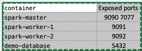
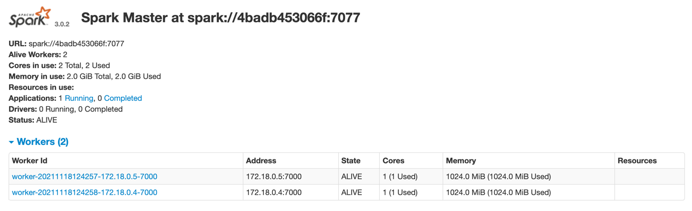

# Docker Python-Spark project
docker-pyspark-project

A simple spark standalone cluster for your testing environment purposses. A docker-compose up away from you solution for your spark development environment.

The Docker compose will create the following containers:




#Installation

The following steps will make you run your spark cluster's containers.

##Pre requisites
1.Docker installed

2.Docker compose installed

** For Mac Docker Engine will have docker compose init so no need to install separately.

#### Build the image

````
docker build -t cluster-apache-spark:3.0.2 . 
````

Run the docker-compose
The final step to create your test cluster will be to run the compose file:

````
docker-compose up -d
````

### Validate the Cluster
```
Spark Master :
localhost:9090 
```


###Mounted Volumes [ localhost:containerHost ]
To make app running easier have shipped two volume mounts in the docker container
````
Host Mount	    Container Mount	
apps	        /opt/spark-apps	Used to make available your app's jars on all workers & master
data	        /opt/spark-data	Used to make available your app's data on all workers & master
````

Finally, Run the spark application to spark cluster ( running in Docker :) ) 

````
/opt/spark/bin/spark-submit --master spark://spark-master:7077 \
--driver-memory 1G \
--executor-memory 1G \
/opt/spark-apps/main.py

````


